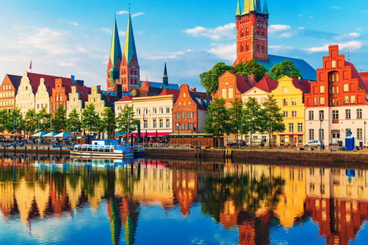

<!DOCTYPE html>
<html>
<head>
    <title>Отдых</title>
</head>
<body  bgcolor="#c0c0c0">
<h1> Страны Азии</h1>

 Китай – густонаселенная страна в Восточной Азии с разнообразными ландшафтами и рельефом. Здесь можно найти луга, пустыни, горы, озера, реки и побережья протяженностью более 14 тыс. км. Столица страны, Пекин, славится современной архитектурой и древними памятниками, среди которых дворцовый комплекс Запретный город и площадь Тяньаньмэнь.

<h2> Страны Европы </h2>

 

 Германия – государство в Западной Европе с лесами, реками, горными хребтами и пляжными курортами Северного моря. История страны охватывает период в более чем две тысячи лет. В столице, Берлине, кипит культурная и ночная жизнь. Многие достопримечательности города, в частности Бранденбургские ворота, напоминают о событиях Второй мировой войны.

<h3>USA</h3>

 

 Соединенные Штаты Америки – государство, состоящее из 50 штатов, занимает значительную часть Северной Америки. Штат Аляска расположен на северо-западе континента, а Гавайи – в Тихом океане. К крупным городам атлантического побережья относятся Нью-Йорк и столица Вашингтон
 

Как оставить заявку на тур 

<a href="https://www.otpusk.com/?gclid=EAIaIQobChMIj9jgt5r17AIVBc53Ch1OrgHgEAAYAiAAEgKj7fD_BwE" target="_blank">подробная информация о заказе тура</a>

<a href="https://www.otpusk.com/?gclid=EAIaIQobChMIj9jgt5r17AIVBc53Ch1OrgHgEAAYAiAAEgKj7fD_BwE" target="_self">подробная информация о заказе тура</a>

</body>
</html>
